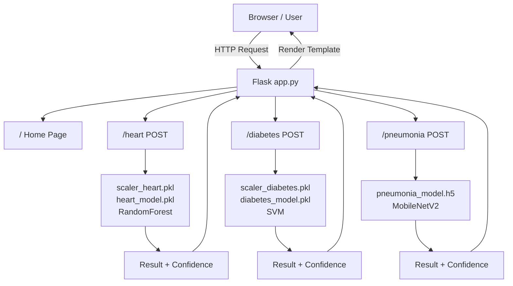

# Architecture

```mermaid
flowchart TD
    User["Browser / User"] -->|HTTP Request| Flask["Flask app.py"]

    Flask --> Home["/ Home Page"]
    Flask --> H["/heart POST"]
    Flask --> D["/diabetes POST"]
    Flask --> P["/pneumonia POST"]

    H --> HS["scaler_heart.pkl\nheart_model.pkl\nRandomForest"]
    D --> DS["scaler_diabetes.pkl\ndiabetes_model.pkl\nSVM"]
    P --> PS["pneumonia_model.h5\nMobileNetV2"]

    HS --> HR["Result + Confidence"]
    DS --> DR["Result + Confidence"]
    PS --> PR["Result + Confidence"]

    HR --> Flask
    DR --> Flask
    PR --> Flask

    Flask -->|Render Template| User
```

