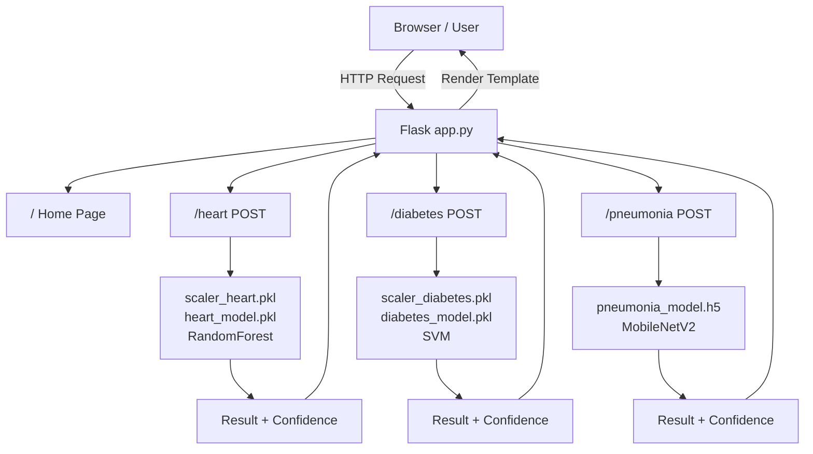

# HealthCure

HealthCure is a Flask-based machine learning web application that predicts possible risks for heart disease, diabetes, and pneumonia. It was built as an academic project to demonstrate how traditional machine learning models and deep learning image classification can be integrated into a simple healthcare-focused web app.

> Disclaimer: HealthCure is a student project and is not intended for real medical diagnosis. Users should always consult a qualified medical professional for health-related decisions.

## Features

- Heart disease prediction using clinical health inputs
- Diabetes prediction using metabolic and health measurements
- Pneumonia detection from chest X-ray image uploads
- Confidence score display for each prediction
- Flask web interface with separate pages for each disease
- Saved machine learning models for faster prediction
- Simple route structure and reusable HTML templates

## Tech Stack

- Python
- Flask
- HTML, CSS, Bootstrap
- NumPy
- Pandas
- scikit-learn
- TensorFlow / Keras
- Pillow
- Joblib

## Machine Learning Models

| Prediction Type | Model Used | Input Type |
| --- | --- | --- |
| Heart Disease | Random Forest Classifier | Clinical values such as age, blood pressure, cholesterol, ECG results, etc. |
| Diabetes | Support Vector Machine | Health values such as glucose, insulin, BMI, age, etc. |
| Pneumonia | MobileNetV2-based CNN | Chest X-ray image |

## Project Architecture



## Folder Structure

```text
healthcure/
├── app.py
├── requirements.txt
├── train_models.py
├── setup_data.py
├── models/
│   ├── heart_model.pkl
│   ├── scaler_heart.pkl
│   ├── diabetes_model.pkl
│   ├── scaler_diabetes.pkl
│   └── pneumonia_model.h5
├── templates/
│   ├── base.html
│   ├── index.html
│   ├── heart.html
│   ├── diabetes.html
│   └── pneumonia.html
├── static/
│   └── css/
│       └── style.css
└── tests/
    └── test_smoke.py
```

## How To Run Locally

1. Clone the repository:

```bash
git clone https://github.com/captainnemo113-art/healthcure.git
cd healthcure
```

2. Create and activate a virtual environment:

```bash
python -m venv .venv
```

On Windows:

```bash
.venv\Scripts\activate
```

On macOS/Linux:

```bash
source .venv/bin/activate
```

3. Install dependencies:

```bash
pip install -r requirements.txt
```

4. Run the Flask app:

```bash
python app.py
```

5. Open the app in your browser:

```text
http://127.0.0.1:5000
```

## Testing

Run the smoke tests:

```bash
pip install pytest
python -m pytest
```

These tests check that the main pages load successfully.

## Dataset Notes

This project uses healthcare datasets for academic learning and model training. The chest X-ray model is trained using image data, while the heart disease and diabetes models use tabular clinical data.

For a production-quality project, large datasets should usually be stored outside the GitHub repository and linked in the README instead.

## Limitations

- This project is for educational use only.
- Predictions may not be clinically accurate.
- The models were trained for demonstration purposes and should not be used as medical tools.
- Real healthcare applications require expert validation, privacy compliance, security review, and clinical testing.

## Future Improvements

- Add user authentication
- Improve model accuracy with more data and validation
- Add detailed model evaluation metrics
- Add more automated tests
- Deploy the app online
- Store uploaded images more securely
- Add a cleaner dashboard-style UI

## Resume Description

```text
Built HealthCure, a Flask-based AI healthcare web app that predicts heart disease, diabetes, and pneumonia using Random Forest, SVM, and MobileNetV2 models, with form-based inputs, X-ray image upload, and confidence score display.
```

## Author

Developed by `captainnemo113-art` as an academic machine learning web application project.
