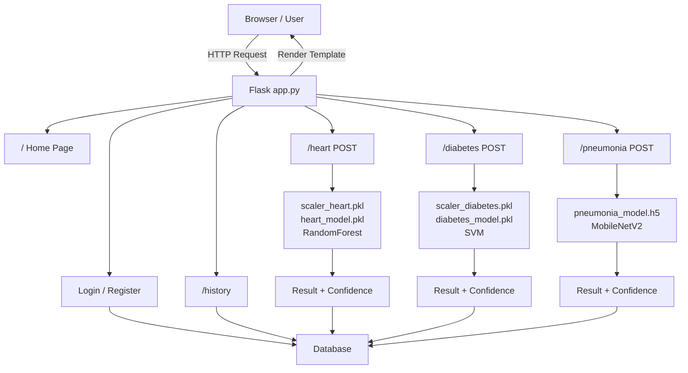
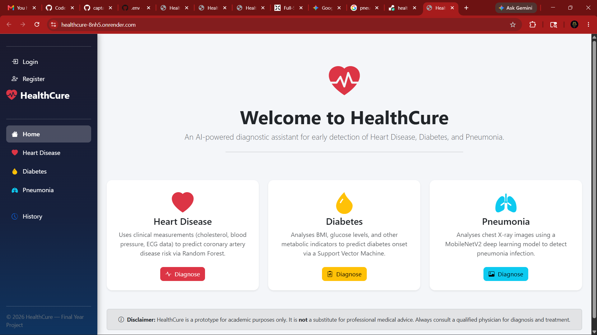
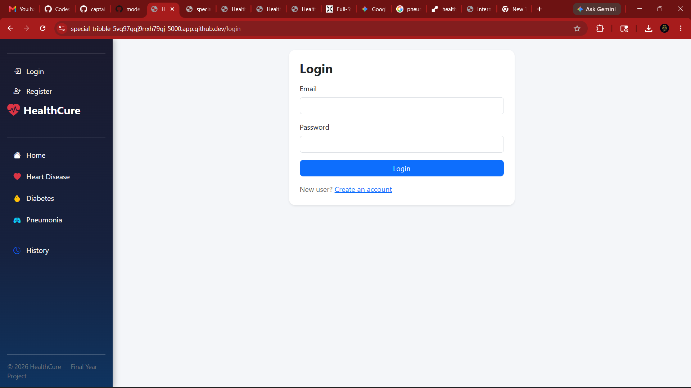
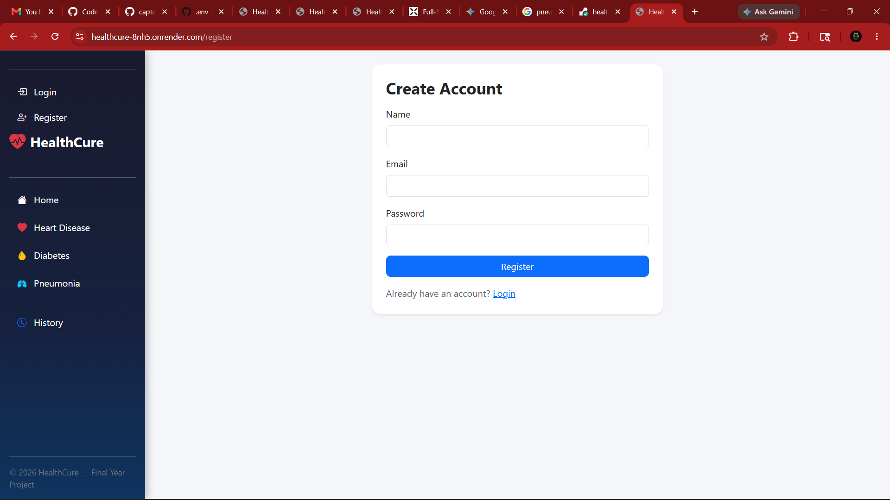
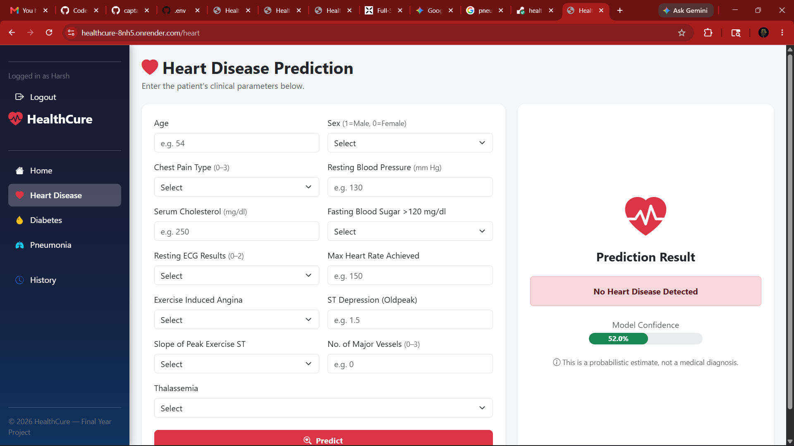
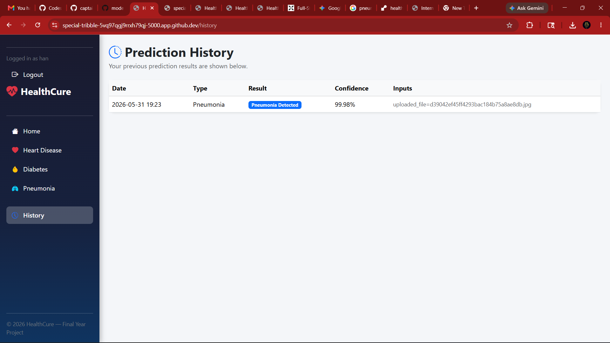

# HealthCure

HealthCure is a full-stack machine learning healthcare web application built with Flask. It allows users to register, log in, predict possible heart disease, diabetes, and pneumonia risk, and view their previous prediction history.

The project combines traditional machine learning models, deep learning image classification, authentication, database storage, REST API endpoints, Docker support, and cloud deployment preparation.

> **Disclaimer:** HealthCure is an academic project and is not intended for real medical diagnosis. Users should always consult a qualified medical professional for health-related decisions.

## Features

- User registration and login
- Password hashing for secure authentication
- Heart disease prediction using a Random Forest model
- Diabetes prediction using an SVM model
- Pneumonia detection using a MobileNetV2-based deep learning model
- Chest X-ray image upload
- Prediction confidence score display
- Prediction history stored in a database
- REST API endpoints for user profile and prediction history
- Docker support
- PostgreSQL support
- Cloud deployment-ready configuration
- Responsive Flask template UI

## Tech Stack

- Python
- Flask
- Flask-Login
- Flask-SQLAlchemy
- HTML
- CSS
- Bootstrap
- SQLite / PostgreSQL
- NumPy
- Pandas
- scikit-learn
- TensorFlow / Keras
- Pillow
- Joblib
- Docker
- Gunicorn
- Render deployment configuration

## Machine Learning Models

| Prediction Type | Model Used | Input Type |
| --- | --- | --- |
| Heart Disease | Random Forest Classifier | Clinical values such as age, blood pressure, cholesterol, ECG results, etc. |
| Diabetes | Support Vector Machine | Health values such as glucose, insulin, BMI, age, etc. |
| Pneumonia | MobileNetV2-based CNN | Chest X-ray image |

## Project Architecture



## Folder Structure

```text
healthcure/
├── app.py
├── models_db.py
├── requirements.txt
├── train_models.py
├── setup_data.py
├── Dockerfile
├── docker-compose.yml
├── render.yaml
├── .python-version
├── models/
│   ├── heart_model.pkl
│   ├── scaler_heart.pkl
│   ├── diabetes_model.pkl
│   ├── scaler_diabetes.pkl
│   └── pneumonia_model.h5
├── templates/
│   ├── base.html
│   ├── index.html
│   ├── heart.html
│   ├── diabetes.html
│   ├── pneumonia.html
│   ├── login.html
│   ├── register.html
│   └── history.html
├── static/
│   ├── css/
│   │   └── style.css
│   └── uploads/
├── screenshots/
└── tests/
    └── test_smoke.py
```

## Screenshots

Add screenshots to the `screenshots/` folder and update the links below.

### Home Page



### Login



### Register



### Heart Disease Prediction



### Diabetes Prediction


### Pneumonia Detection


### Prediction History



## How To Run Locally

### 1. Clone The Repository

```bash
git clone https://github.com/captainnemo113-art/healthcure.git
cd healthcure
```

### 2. Create Virtual Environment

```bash
python -m venv .venv
```

On Windows:

```bash
.venv\Scripts\activate
```

On macOS/Linux:

```bash
source .venv/bin/activate
```

### 3. Install Dependencies

```bash
pip install -r requirements.txt
```

### 4. Create Environment File

Create a `.env` file in the project root:

```env
SECRET_KEY=change-this-secret-key
DATABASE_URL=sqlite:///healthcure.db
```

### 5. Initialize Database

```bash
flask --app app init-db
```

### 6. Run The App

```bash
python app.py
```

Open:

```text
http://127.0.0.1:5000
```

## Run With Docker

Build and start the app:

```bash
docker compose up --build
```

Initialize the database inside the container:

```bash
docker compose exec web flask --app app init-db
```

Open:

```text
http://localhost:5000
```

To stop Docker:

```bash
docker compose down
```

## REST API Endpoints

Authentication is session-based, so API routes require the user to be logged in.

| Method | Endpoint | Description |
| --- | --- | --- |
| GET | `/api/me` | Returns the logged-in user's profile |
| GET | `/api/history` | Returns the logged-in user's prediction history |
| POST | `/api/predict/heart` | Runs heart disease prediction |
| POST | `/api/predict/diabetes` | Runs diabetes prediction |

Example heart prediction JSON:

```json
{
  "age": 54,
  "sex": 1,
  "cp": 0,
  "trestbps": 130,
  "chol": 250,
  "fbs": 0,
  "restecg": 1,
  "thalach": 150,
  "exang": 0,
  "oldpeak": 1.5,
  "slope": 1,
  "ca": 0,
  "thal": 3
}
```

Example diabetes prediction JSON:

```json
{
  "pregnancies": 2,
  "glucose": 120,
  "blood_pressure": 70,
  "skin_thickness": 20,
  "insulin": 80,
  "bmi": 28.5,
  "dpf": 0.627,
  "age": 33
}
```

## Testing

Run smoke tests:

```bash
pip install pytest
python -m pytest
```

The smoke tests check that the main pages load successfully.

## Deployment

This project includes Render deployment configuration.

Important deployment settings:

```text
Build Command: pip install -r requirements.txt
Start Command: gunicorn app:app
```

Recommended environment variables:

```env
SECRET_KEY=your-production-secret-key
DATABASE_URL=your-database-url
```

The repository includes a `.python-version` file to ensure Render uses a Python version compatible with the ML dependencies.

## Dataset Notes

This project uses healthcare datasets for academic learning and model training. The chest X-ray model is trained using image data, while the heart disease and diabetes models use tabular clinical data.

For a production-quality project, large datasets should usually be stored outside the GitHub repository and linked in the README instead.

## Limitations

- This project is for educational use only.
- Predictions may not be clinically accurate.
- The models were trained for demonstration purposes and should not be used as medical tools.
- Real healthcare applications require expert validation, privacy compliance, security review, and clinical testing.
- The app is not HIPAA-compliant or intended for storing real patient data.

## Future Improvements

- Add JWT-based API authentication
- Add admin dashboard
- Improve model evaluation and display accuracy metrics
- Add more automated tests
- Add cloud file storage for uploaded images
- Improve UI with charts and analytics
- Add proper database migrations with Flask-Migrate
- Deploy with managed PostgreSQL
- Add CI/CD with GitHub Actions

## Resume Highlight

Built HealthCure, a full-stack Flask machine learning healthcare web app with authentication, database-backed prediction history, REST API endpoints, Docker support, PostgreSQL support, and ML models for heart disease, diabetes, and pneumonia prediction.

## Author

Developed by `captainnemo113-art` as an academic full-stack machine learning web application project.
